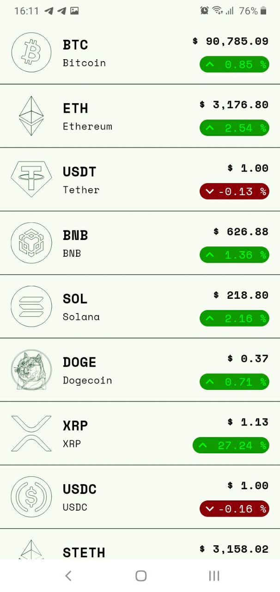

# CryptoTrackerApp
<div style="text-align: center;">


</div>

## Overview
CryptoTrackerApp is an Android app designed to track cryptocurrency prices. It fetches real-time data from the [CoinCap API](https://docs.coincap.io/) and displays it to the user. The app is built following the CLEAN Architecture principles to ensure scalability, maintainability, and testability.

## Features
- **Real-time Data**: Fetches and displays up-to-date cryptocurrency prices.
- **User-Friendly Interface**: Simple and intuitive UI for easy navigation.
- **CLEAN Architecture**: Ensures a well-organized codebase, making it easier to maintain and extend.

## Technologies Used
- **Kotlin**: Used for the app development.
- **MVVM Architecture**: Utilized for separation of concerns and better code organization.
- **Ktor**: For network requests to fetch data from the Koin API.
- **LiveData and ViewModel**: For managing UI-related data in a lifecycle-conscious way.
- **Koin**: Dependency injection framework for Kotlin.

## How to Run the Project
1. **Clone the Repository**: 
   ```git clone <repository-url>```
